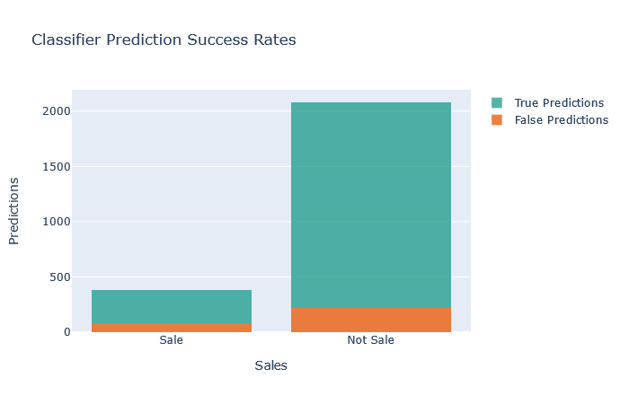

by Carly Tsuda, for the Flatiron School Data Science Program, Phase 3


### Business problem:
The project in this repository creates classifier models to attempt to determine which sessions on an ecommerce website resulted in sales. The imagined audience is a web development startup (such as SquareSpace) which hopes to create new features to help clients get the most out of their online stores.

### Data:
The dataset comes from the UCI machine learning repository. It contains data on 12,330 unique sessions on an unspecified ecommerce site from 2018.

### Methods:
I used three classification models (Logistic Regression, Decision Tree, and Random Forest) to determine predict which sessions ended in sales. For the Decision Tree and Random Forest, I also implemented a Grid Search to find the optimal combination of hyperparameters. I implemented the entire process in a data science Pipeline to streamline preprocessing.

### Results:

Each of the three classification models quickly converged at similar metrics. Both the Decision Tree and Random Forest were overwhelmingly weighted toward a single feature: average Page Value (determined by Google Analytics).



Model | Accuracy (Train) | Accuracy (Test) | Precision (Train) | Precision (Test) | Recall (Train) | Recall (Test) | f1 (Train)| f1 (Test) | AUC | 
-|-|-|-|-|-|-|-|-|-
Logistic Regression | 0.85 | 0.84  | 0.52 | 0.50  | 0.77 | 0.77  | 0.62 | 0.61  | 0.91
Decision Tree | 0.90 | 0.89  | 0.91 | 0.61  | 0.88 | 0.76  | 0.90 | 0.67  | 0.90
Random Forest | 0.90 |<0.88  | 0.89 | 0.58  | 0.91 | 0.79  | 0.90 | 0.67  | 0.90

### Reccomendations:
The strength of the Page Values section affirms the efficacy of analytic data. Recommendations included a focus on empowering site owners to leverage analytic data to enhave existing business understanding.

### For further information:
Please review the narrative of the analysis in [my jupyter notebook](./Project_3_actual.ipynb) and review [my non-technical presentation](./EcommerceClassification_Nontechnical.pdf).

#### Repository structure:
```
├── README.md                       
├── Project_3_actual.ipynb                             <- Jupyter Notebook presentation
├── EcommerceClassification_Nontechnical.pdf           <- Non-technical presentation
├── Final_Project3_Notebook.pdf                        <- PDF of Jupyter Notebook
└── img                                                <- directory containing visualizations and images for presentation
    └── images    
└── data                                               <- contains original dataset and data dictionary
